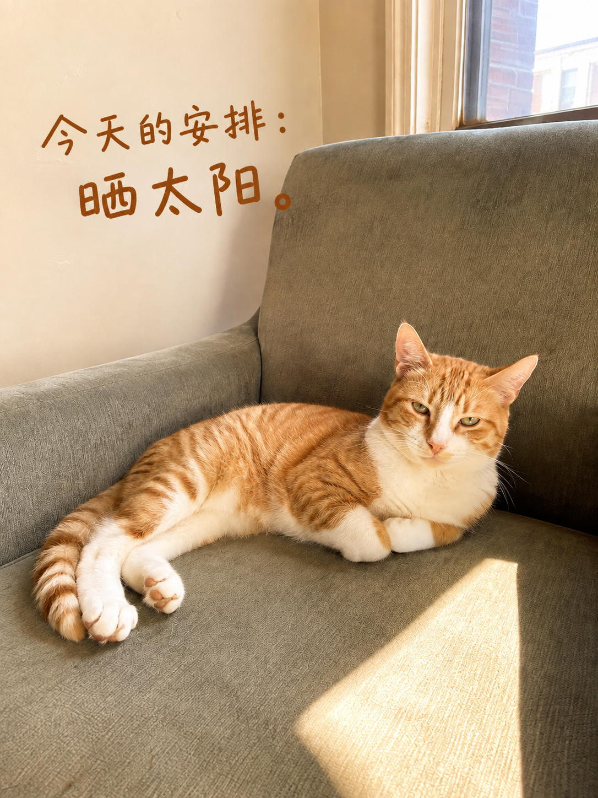

# 照片有话说 · Plog

### 把拍下的日常，写成有画面的日记。

发照片，说一句想记录什么。**文案、色调、氛围和排版，由 Agent 根据照片自动完成。**

[快速开始](#快速开始) · [看前后变化](#从一张照片到一页-plog) · [Agent 适配](#在你常用的-agent-里使用)

<p align="center">
  <a href="#人物相聚"></a>
  <a href="#山海旅行"></a>
</p>

<p align="center"><sub>有人相聚，也有山海独处。每一张照片，都有自己的语气。</sub></p>

人物、街头人文、山海、食物与宠物，都能成为一页 Plog。你不必先写配文、挑滤镜或选模板；做好后，直接说“换句话”“字更有张力”“从第一版继续”。

<sub>展示原图为原创 AI 素材，含虚构人物；成图由对应原图实际编辑生成。[素材与过程说明](examples/readme/MANIFEST.md)</sub>

## 快速开始

```sh
npx skills add https://github.com/JoeWu-explorer/photo-dialogue --skill photo-dialogue
```

安装后，在支持 Skills、读图与图片编辑的 Agent 中发照片，说：

```text
用 photo-dialogue 把这些照片做成一组中文 Plog，文字自然一点，像我的日记。
```

<details>
<summary>也可以让 Agent 帮你安装</summary>

```text
请运行 npx skills add https://github.com/JoeWu-explorer/photo-dialogue --skill photo-dialogue 安装「照片有话说」。
安装后读取 SKILL.md，在独立环境准备必要依赖并自检，检查读图与图片编辑工具是否可用。
```

</details>

<sub>仓库当前为私有，安装需要访问权限。首次环境配置见 [安装指南](docs/install.md)。</sub>

## 从一张照片，到一页 Plog

**你给照片，Agent 找到要说的话，也安排它在画面里的位置。**

配文来自照片里的细节；光色沿着场景的气氛；字形、大小和断行围绕一句话的重点展开。下面是同一张照片的处理前后，点击图片可查看 PNG 原文件。

<sub>人物、手艺、山海和街景展示根据“字和排版更有张力”修改后的第二版；宠物与早餐展示第一版。此处为效果展示，尚未完成正式视觉验收。[版本记录](examples/readme/MANIFEST.md)</sub>

### 人与日常

#### 人物相聚

<table>
  <tr><th width="50%">拍下的瞬间</th><th width="50%">自动生成的 Plog</th></tr>
  <tr>
    <td width="50%"><a href="examples/readme/together/before.png"></a></td>
    <td width="50%"><a href="examples/readme/together/after-v2.png"></a></td>
  </tr>
</table>

**茶还没凉， 话还没聊完。**<br><sub>温润院落光 · 细字起句，浓墨大字落句 · 留住人物的目光与动作</sub>

<details>
<summary>查看这张的创作指令</summary>

> 这是朋友聚在一起喝茶，帮我做成温暖自然的 Plog。

随后统一提出：“字和排版更有张力。”具体配文与设计由 Agent 决定。

</details>

#### 人文手艺

<table>
  <tr><th width="50%">拍下的瞬间</th><th width="50%">自动生成的 Plog</th></tr>
  <tr>
    <td width="50%"><a href="examples/readme/craft/before.png"></a></td>
    <td width="50%"><a href="examples/readme/craft/after-v2.png"></a></td>
  </tr>
</table>

**一挑一压 慢慢成形**<br><sub>靛蓝与竹色 · 侧置字阵，呼应编织节奏 · 让手艺成为画面中心</sub>

<details>
<summary>查看这张的创作指令</summary>

> 记录这位手艺人做竹编的瞬间，做成安静一点的人文 Plog。

随后统一提出：“字和排版更有张力。”具体配文与设计由 Agent 决定。

</details>

---

### 旅行与街景

#### 山海旅行

<table>
  <tr><th width="50%">拍下的瞬间</th><th width="50%">自动生成的 Plog</th></tr>
  <tr>
    <td width="50%"><a href="examples/readme/coast/before.png"></a></td>
    <td width="50%"><a href="examples/readme/coast/after-v2.png"></a></td>
  </tr>
</table>

**山海很大 今天很慢**<br><sub>清透青绿 · 小字铺垫，笔势舒展 · 天空与海岸形成尺度对照</sub>

<details>
<summary>查看这张的创作指令</summary>

> 把这张海边照片做成 Plog，留住那种开阔感。

随后统一提出：“字和排版更有张力。”具体配文与设计由 Agent 决定。

</details>

#### 城市街景

<table>
  <tr><th width="50%">拍下的瞬间</th><th width="50%">自动生成的 Plog</th></tr>
  <tr>
    <td width="50%"><a href="examples/readme/city/before.png"></a></td>
    <td width="50%"><a href="examples/readme/city/after-v2.png"></a></td>
  </tr>
</table>

**雨落下来 街慢下来**<br><sub>冷蓝雨色与暖窗光 · 米白双列竖排 · 沿着街巷读下去</sub>

<details>
<summary>查看这张的创作指令</summary>

> 把这张雨天街景做成 Plog，文字像随手记下的一句话。

随后统一提出：“字和排版更有张力。”具体配文与设计由 Agent 决定。

</details>

---

### 生活里的小事

#### 宠物陪伴

<table>
  <tr><th width="50%">拍下的瞬间</th><th width="50%">自动生成的 Plog</th></tr>
  <tr>
    <td width="50%"><a href="examples/readme/cat/before.png"></a></td>
    <td width="50%"><a href="examples/readme/cat/after.png"></a></td>
  </tr>
</table>

**今天的安排： 晒太阳。**<br><sub>奶油暖光 · 轻快手写字 · 把留白留给这份悠闲</sub>

<details>
<summary>查看这张的创作指令</summary>

> 把猫咪晒太阳这张做成 Plog，俏皮一点。

具体配文与设计由 Agent 决定。

</details>

#### 食物日常

<table>
  <tr><th width="50%">拍下的瞬间</th><th width="50%">自动生成的 Plog</th></tr>
  <tr>
    <td width="50%"><a href="examples/readme/table/before.png"></a></td>
    <td width="50%"><a href="examples/readme/table/after.png"></a></td>
  </tr>
</table>

**早餐还热 慢慢吃吧**<br><sub>暖木色与柔亮日光 · 咖啡色手写字 · 日常的一点热气</sub>

<details>
<summary>查看这张的创作指令</summary>

> 把这张早餐照片做成日常 Plog。

具体配文与设计由 Agent 决定。

</details>

[更多风格示意](examples/readme/README.md) · [查看素材与版本过程](examples/readme/MANIFEST.md)

---

## 一天，几张照片，一条线索

组图从你给出的顺序和主题出发，协调每一页的文字与视觉节奏：第一张可以交代心情，第二张留下一个观察，最后一张收住当天的感受。

每张仍然独立成图、独立保存版本。你可以只改第二张的旁白，或让第三张回到旧版。不会因修改一张就重新生成整组；某张失败时会单独说明进度。

例如，上传三张照片后说：

```text
用 photo-dialogue 做一组「周末不赶路」Plog。
顺序是山路、街边小店、晚餐，每张独立成图。
文字有一点联系，但不要每张都写同一句标题。
```

## 从照片到成图，会发生什么

**读照片 → 确定文字与视觉方向 → 以照片编辑 → 对照检查 → 保存 PNG 与版本 → 根据反馈继续修改。**

- **先找到这一页要记住的事。** 根据照片和你的说明选择旁白、对白或无字处理，未知的地名、人物关系和经历不补写成事实。
- **逐张安排文字与画面。** 根据主体、光线和留白设计字形、主次层级与氛围，让文字和画面形成呼应，避开脸、地标轮廓和重要细节。
- **带着原图检查结果。** 检查中文可读性、山形、建筑、物体与人物特征；修改时也对照所选旧版。
- **把作品留给下一次对话。** 检查通过才保存为可交付版本，保留修改记录，支持查看旧版、继续编辑和导出文字。

## 在你常用的 Agent 里使用

照片有话说使用标准 `SKILL.md`，技能名称统一为 `photo-dialogue`。不同宿主使用同一套创作与版本流程，图像工具按当前环境接入。

**OpenClaw · Hermes · Claude Code · DeepSeek Harness · Codex · 其他符合能力要求的 Agent**

<details>
<summary>查看各 Agent 的接入方式</summary>

| Agent | 接入方式 |
| --- | --- |
| OpenClaw | 当前视觉工具与支持照片编辑的图片工具，也可接兼容 API。 |
| Hermes | 视觉分析与支持编辑的图片工具，也可接兼容 API。 |
| Claude Code | 当前模型读图，搭配图片编辑 MCP、CLI 或兼容 API。 |
| DeepSeek Harness | 视觉与图片编辑插件，或独立的兼容 API。 |
| Codex | 可用的原生看图与编辑工具，或兼容 API。 |
| 其他 Agent | 能加载技能、执行 Python、读写文件、看图、以图编辑并交付附件即可按同一流程接入。 |

</details>

**目前已提供上述适配路径，真实宿主与图像服务的完整创作流程仍待逐项实测。** 安装成功不代表图像服务已就绪，具体目录、能力要求和验证记录见 [适配说明](docs/agent-compatibility.md)。

## 使用前了解这几件事

- **版本：** 当前预发布为 [v0.1.0-alpha.4](https://github.com/JoeWu-explorer/photo-dialogue/releases/tag/v0.1.0-alpha.4)；上面的 npx 命令安装 main 分支源码。
- **照片与环境：** 静态 JPEG、PNG、WebP；HEIC/HEIF 可选。文件工具需要 macOS、Linux 或 WSL 中的 CPython 3.11–3.13。
- **图片服务：** 使用你配置的读图与编辑服务，模型与费用取决于该服务。需要外发照片时会说明接收服务和用途，承接已有授权。
- **生成效果：** 生成式编辑不保证像素完全不变；检查无法通过时会说明问题，不自动重复生成或消耗第二次额度。
- **保存位置：** 默认在 Agent 执行环境的 `~/Pictures/PhotoDialogue/`。远程 Agent 通过当前会话交付文件；保留原图与作品目录，方便以后继续修改。

## 文档与项目

[安装、更新与卸载](docs/install.md) · [使用与排错](docs/guide.md) · [开发与仓库地图](CONTRIBUTING.md) · [版本与验证](docs/README.md)

README 的快速上手组织方式参考了 [Yingzao · 营造](https://github.com/op7418/guizang-yingzao-skill)。照片有话说围绕日常 Plog、组图叙事与对话式版本修改展开，文字和使用示例独立编写。

代码与文档采用 [MIT](LICENSE)。图片按各自清单授权，见 [第三方通知](THIRD_PARTY_NOTICES.md)。
