<p align="center">
  <a href="examples/readme/collection-cover.png">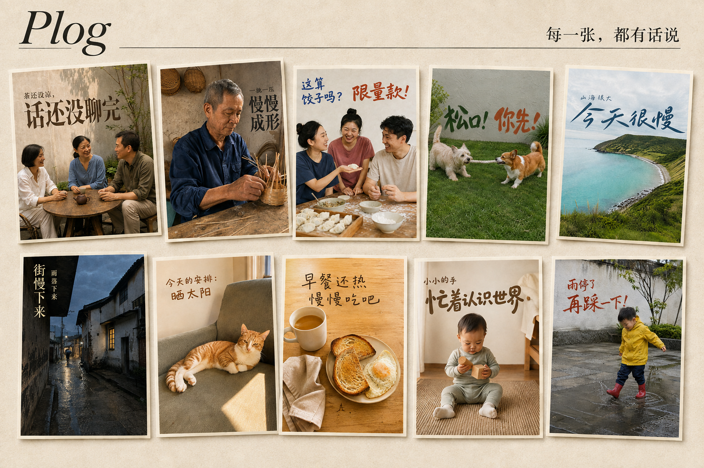</a>
</p>

# 照片有话说 · Plog

### 把拍下的日常，写成有画面的日记

**发照片，说一句想记录什么。文案、色调、氛围和排版，由 Agent 根据照片自动完成。**

把照片里的日常，做成有故事、有氛围、有设计感的 Plog。无论人物相聚、儿童成长、山海旅行、城市街景，还是美食、静物与宠物，照片有话说都会从画面中的动作、神态与细节出发，自动创作贴合场景的中文文案，并搭配光色、字形和排版。

可以是安静的日记旁白，也可以是多人之间的一问一答，或小动物之间的俏皮互动。多张照片可以串成一组日记；做好后，直接用自然语言修改文字、氛围与布局，保留每次版本，也能从旧版继续创作。面向不同 Agent 提供统一的 Skill 工作流，从“发照片、说想法”开始，把拍下的瞬间变成值得分享的一页。

[快速开始](#快速开始) · [作品画廊](#每一种日常都有自己的语气) · [前后对照](#从一张照片到一页-plog) · [Agent 适配](#在你常用的-agent-里使用)

<sub>展示原图为原创 AI 素材，含虚构人物；单张成图由对应原图编辑生成，部分标点另作局部修整。封面为生成式合集预览，单张作品与原图对照见下方画廊。[素材与过程](examples/readme/MANIFEST.md)</sub>

## 快速开始

```sh
npx skills add https://github.com/JoeWu-explorer/plog-skill --skill plog
```

安装后，在支持 Skills、读图与图片编辑的 Agent 中发照片，说：

```text
用 plog 把这些照片做成一组中文 Plog，文字自然一点，像我的日记。
```

<details>
<summary>也可以让 Agent 帮你安装</summary>

```text
请运行 npx skills add https://github.com/JoeWu-explorer/plog-skill --skill plog 安装「照片有话说」。
安装后读取 SKILL.md，在独立环境准备必要依赖并自检，检查读图与图片编辑工具是否可用。
```

</details>

<sub>仓库当前为私有，安装需要访问权限。首次环境配置见 [安装指南](docs/install.md)。</sub>

## 每一种日常，都有自己的语气

先看成图。每张的文案、光色和字形，都从照片里的细节出发。点击图片查看原尺寸 PNG。

### 相聚的人，专注的手

<p align="center">
  <a href="examples/readme/together/after-v3.png">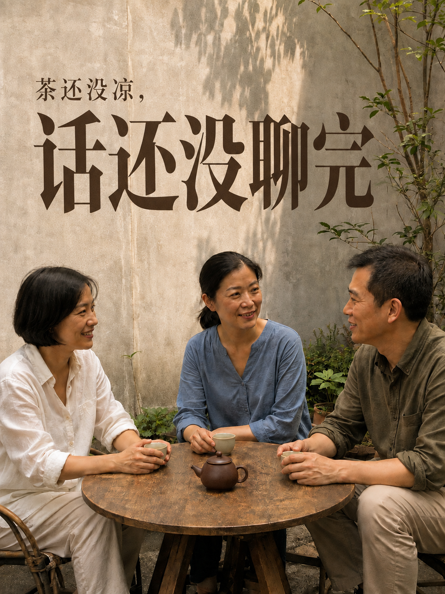</a>
  <a href="examples/readme/craft/after-v2.png">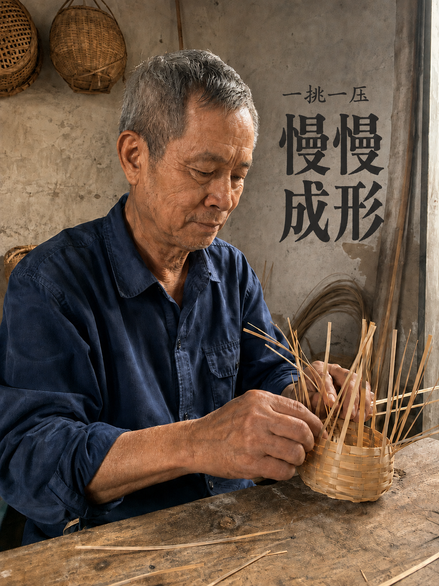</a>
</p>

**左 · 人物相聚**　茶还没凉， 话还没聊完

**右 · 人文手艺**　一挑一压 慢慢成形

<details>
<summary>查看这两张的原图与创作指令</summary>

**人物相聚 · 左为原图，右为成图**

<p align="center">
  <a href="examples/readme/together/before.png">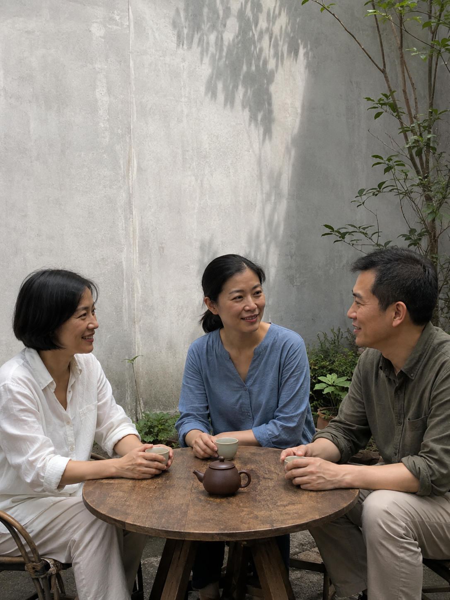</a>
  <a href="examples/readme/together/after-v3.png"></a>
</p>

> 这是朋友聚在一起喝茶，帮我做成温暖自然的 Plog。

温润院落光；细字起句、宽幅浓墨展示字落句，让文字与三人的相聚形成重心呼应。

**人文手艺 · 左为原图，右为成图**

<p align="center">
  <a href="examples/readme/craft/before.png">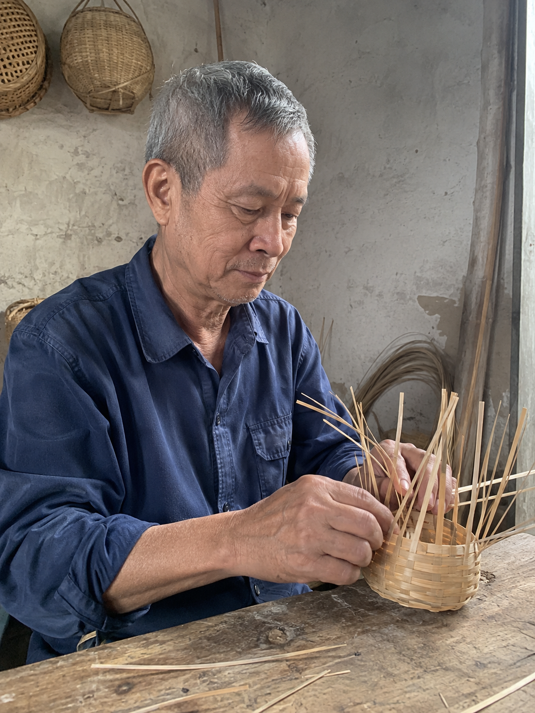</a>
  <a href="examples/readme/craft/after-v2.png"></a>
</p>

> 记录这位手艺人做竹编的瞬间，做成安静一点的人文 Plog。

靛蓝与竹色保持安静；右侧窄幅纵向字阵、粗细对比，呼应竹编的纵横节奏。

</details>

### 你一句，我一句

<p align="center">
  <a href="examples/readme/kitchen/after.png">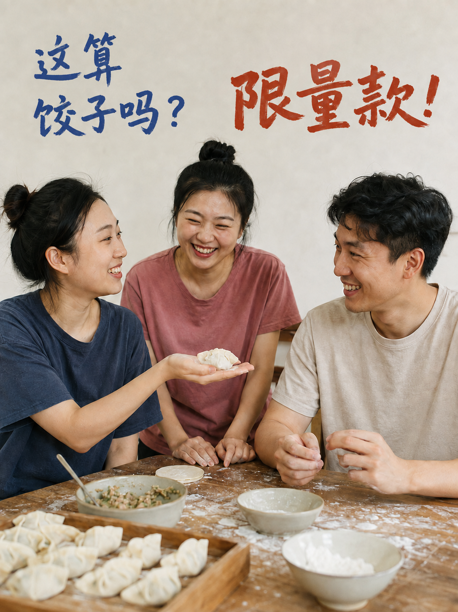</a>
  <a href="examples/readme/playmates/after.png">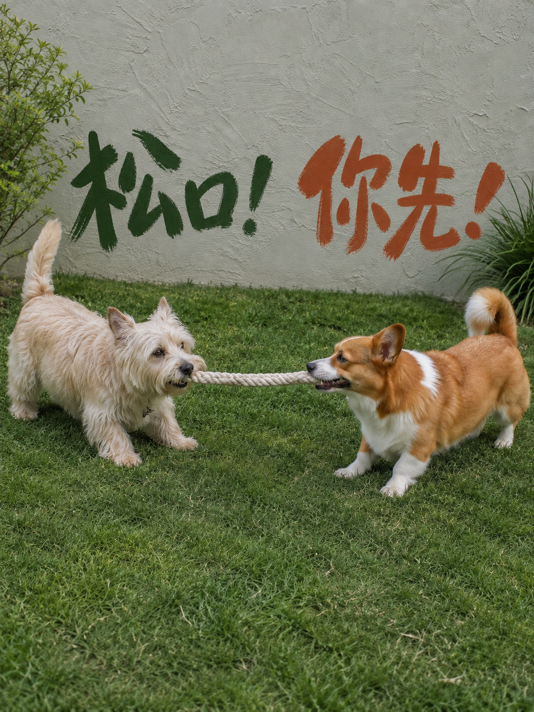</a>
</p>

**左 · 多人互动**　这算饺子吗？ / 限量款！

**右 · 多宠互动**　松口！ / 你先！

<sub>从互相打趣的目光、共同玩着的物件里找到对白。这里的人物对白与动物拟人对白都是创作配文。</sub>

<details>
<summary>查看这两张的原图与创作指令</summary>

**多人互动 · 左为原图，右为成图**

<p align="center">
  <a href="examples/readme/kitchen/before.png">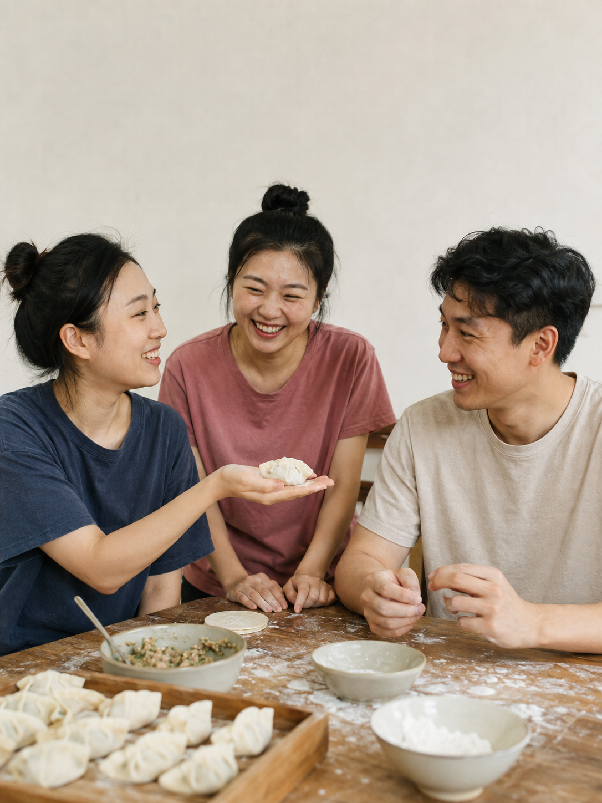</a>
  <a href="examples/readme/kitchen/after.png"></a>
</p>

> 把三个人包饺子的照片做成有一问一答的 Plog

托起的饺子、对视和笑容构成互动。左侧问句用靛蓝手写字，右侧答句用更厚重的赭红笔字；中间的人以表情回应，不给每个人硬加一句话。

**多宠互动 · 左为原图，右为成图**

<p align="center">
  <a href="examples/readme/playmates/before.png">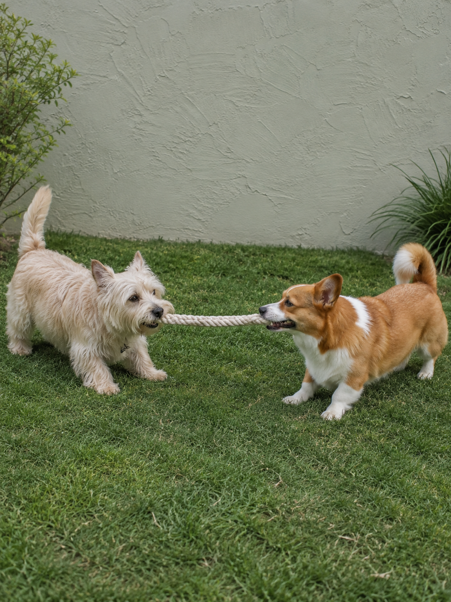</a>
  <a href="examples/readme/playmates/after.png"></a>
</p>

> 把两只狗拔河的照片做成互相斗嘴的 Plog

同一根绳子连接两只狗，左右两块大字互相应答。森林绿与铁锈色呼应草地和毛色，保留原有光色、动物姿态与拔河动作。

[生成与修订记录](examples/readme/MANIFEST.md#第五轮多人和多宠互动)

</details>

### 走向山海，走进街巷

<p align="center">
  <a href="examples/readme/coast/after-v2.png">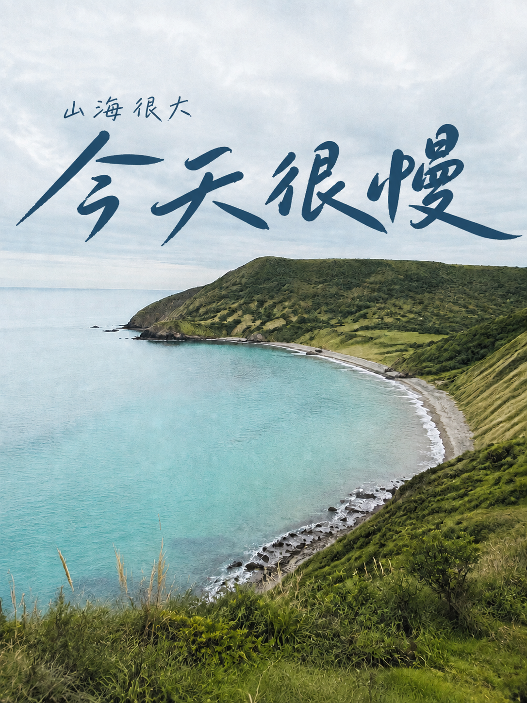</a>
  <a href="examples/readme/city/after-v2.png">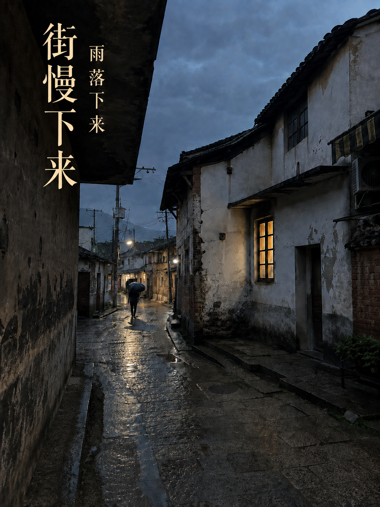</a>
</p>

**左 · 山海旅行**　山海很大 今天很慢

**右 · 城市街景**　雨落下来 街慢下来

<details>
<summary>查看这两张的原图与创作指令</summary>

**山海旅行 · 左为原图，右为成图**

<p align="center">
  <a href="examples/readme/coast/before.png">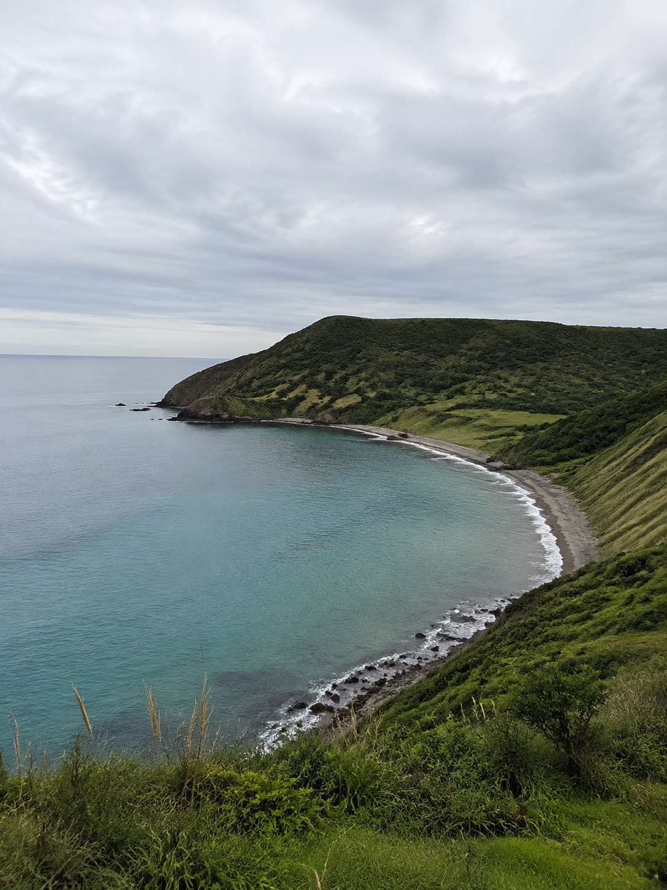</a>
  <a href="examples/readme/coast/after-v2.png"></a>
</p>

> 把这张海边照片做成 Plog，留住那种开阔感。

清透青绿；小字铺垫、舒展的大字横跨天空，与弧形海岸形成尺度对照。

**城市街景 · 左为原图，右为成图**

<p align="center">
  <a href="examples/readme/city/before.png">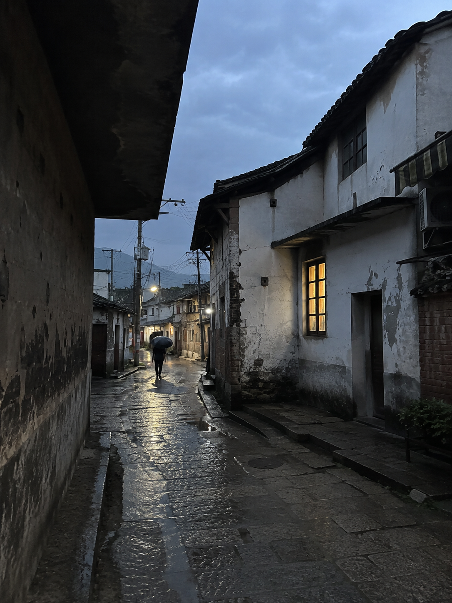</a>
  <a href="examples/readme/city/after-v2.png"></a>
</p>

> 把这张雨天街景做成 Plog，文字像随手记下的一句话。

冷蓝雨色与暖窗光；两列错位竖排米白字，沿屋檐和街巷建立阅读节奏。

</details>

### 一只猫，一顿早餐

<p align="center">
  <a href="examples/readme/cat/after-v2.png"></a>
  <a href="examples/readme/table/after.png">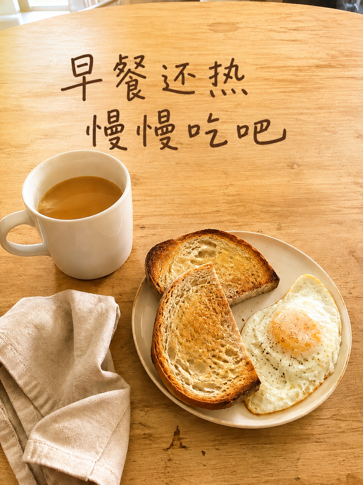</a>
</p>

**左 · 宠物陪伴**　今天的安排： 晒太阳

**右 · 食物日常**　早餐还热 慢慢吃吧

<details>
<summary>查看这两张的原图与创作指令</summary>

**宠物陪伴 · 左为原图，右为成图**

<p align="center">
  <a href="examples/readme/cat/before.png">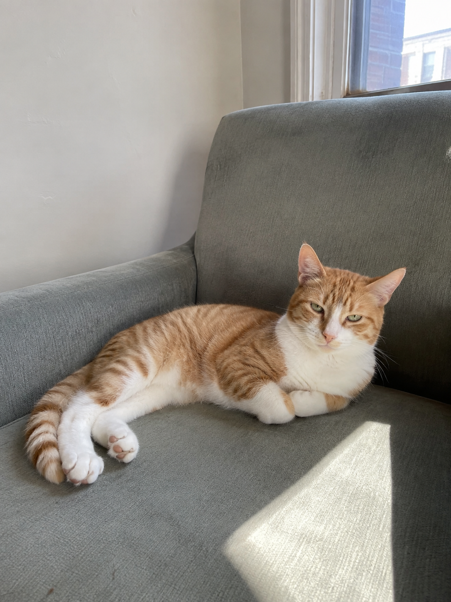</a>
  <a href="examples/readme/cat/after-v2.png"></a>
</p>

> 把猫咪晒太阳这张做成 Plog，俏皮一点。

奶油暖光、保留橘白毛色；轻快文字避开猫咪。

**食物日常 · 左为原图，右为成图**

<p align="center">
  <a href="examples/readme/table/before.png">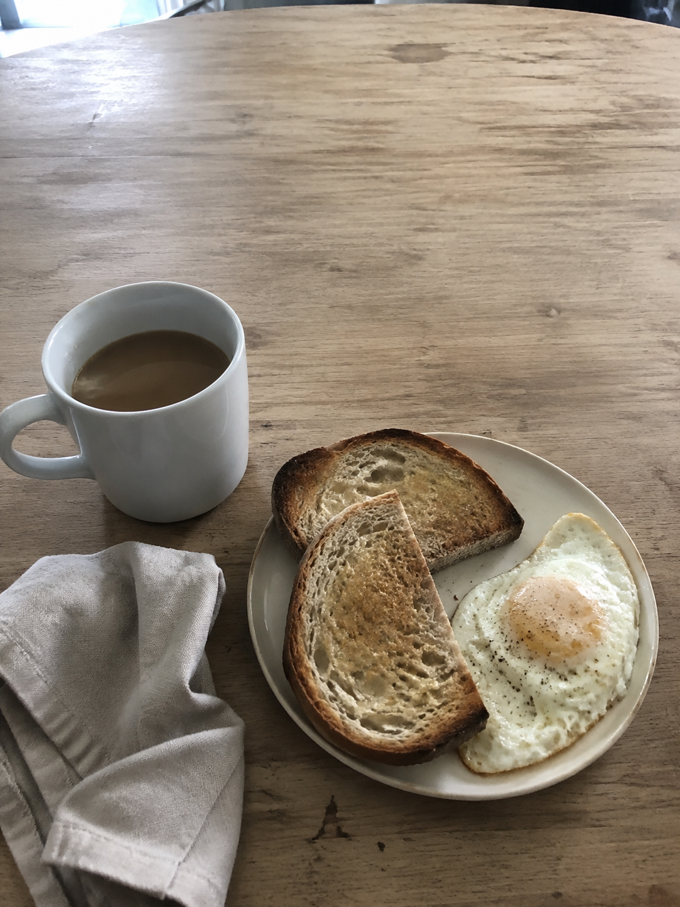</a>
  <a href="examples/readme/table/after.png"></a>
</p>

> 把这张早餐照片做成日常 Plog。

暖木色与柔亮日光；咖啡色手写字放在空桌面。

</details>

### 小小的手，雨里的脚步

<p align="center">
  <a href="examples/readme/baby/after.png">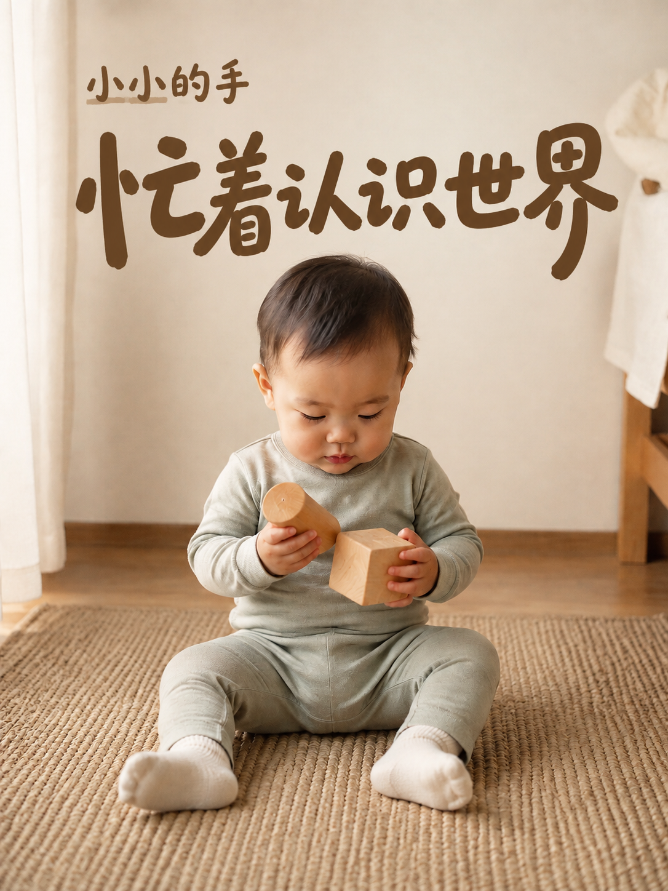</a>
  <a href="examples/readme/child/after.png">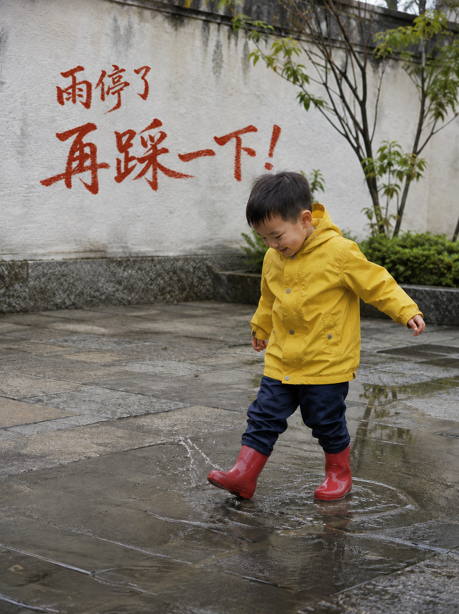</a>
</p>

**左 · 婴儿日常**　小小的手 忙着认识世界

**右 · 童年探索**　雨停了 再踩一下！

<details>
<summary>查看这两张的原图与创作指令</summary>

**婴儿日常 · 左为原图，右为成图**

<p align="center">
  <a href="examples/readme/baby/before.png">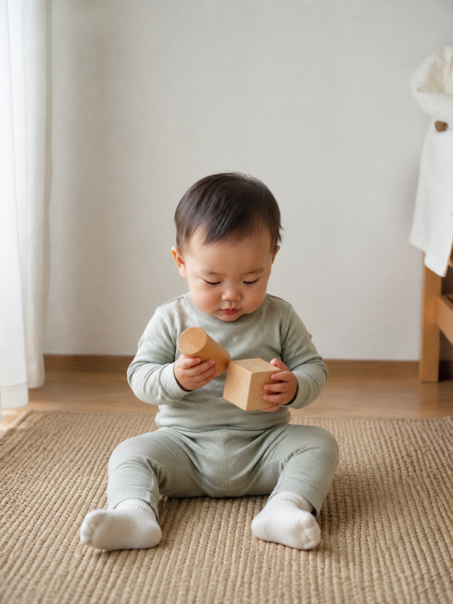</a>
  <a href="examples/readme/baby/after.png"></a>
</p>

> 把宝宝玩积木的照片做成温暖的成长 Plog

从手里握着的积木写出成长旁白；奶油暖光、栗棕圆润大字，在头顶留白里拉开主次。

**童年探索 · 左为原图，右为成图**

<p align="center">
  <a href="examples/readme/child/before.png">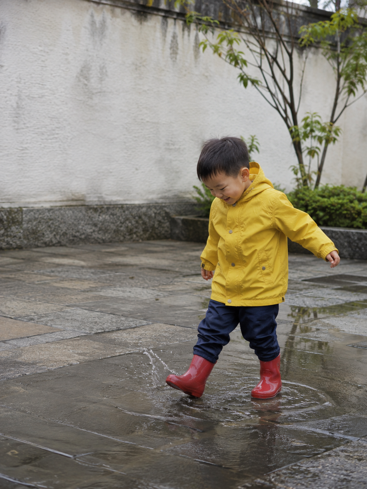</a>
  <a href="examples/readme/child/after.png"></a>
</p>

> 把雨后踩水的照片做成活泼一点的童年 Plog

保留雨后的自然光色，砖红笔字呼应雨靴；大字的轻快笔势与踩水动作相呼应，保留句末感叹号。

两张文案都是创作旁白，人物均为虚构。[生成与修订记录](examples/readme/MANIFEST.md#第四轮婴儿与儿童日常)

</details>

## 从一张照片，到一页 Plog

**左：拍下的瞬间　→　右：Agent 完成的 Plog**

<p align="center">
  <a href="examples/readme/together/before.png"></a>
  <a href="examples/readme/together/after-v3.png"></a>
</p>

你只说“朋友聚在一起喝茶，做成温暖自然的 Plog”。Agent 从相聚的细节里写出“茶还没凉，话还没聊完”，选择温润院落光；再根据“字和排版更有张力”的反馈，以细字铺垫、浓墨大字落句。

**文案、色调、氛围与排版一起改变，原图与每次修改都保留。**

<details>
<summary>素材、版本与验证说明</summary>

当前展示：人物相聚 v003；人文手艺、山海、街景与宠物 v002；早餐、婴儿、儿童、多人互动与多宠互动 v001。人物相聚和宠物的最新一次修改仅处理句末句号。儿童与多人互动案例各经过一次未通过候选后的定向修订，未将其记作单次成功。其余原图及创作指令可在各组作品下展开。

这些是合成素材的实际编辑展示，尚未完成正式视觉验收。[完整版本与处理记录](examples/readme/MANIFEST.md) · [素材来源与使用范围](docs/image-rights.md) · [更多风格示意](examples/readme/README.md)

</details>

## 一天，几张照片，一条线索

组图从你给出的顺序和主题出发，协调每一页的文字与视觉节奏：第一张可以交代心情，第二张留下一个观察，最后一张收住当天的感受。

每张仍然独立成图、独立保存版本。你可以只改第二张的旁白，或让第三张回到旧版。不会因修改一张就重新生成整组；某张失败时会单独说明进度。

例如，上传三张照片后说：

```text
用 plog 做一组「周末不赶路」Plog。
顺序是山路、街边小店、晚餐，每张独立成图。
文字有一点联系，但不要每张都写同一句标题。
```

## 从照片到成图，会发生什么

**读照片 → 确定文字与视觉方向 → 以照片编辑 → 对照检查 → 保存 PNG 与版本 → 根据反馈继续修改。**

- **先找到这一页要记住的事。** 根据照片和你的说明选择旁白、对白或无字处理，未知的地名、人物关系和经历不补写成事实。
- **逐张安排文字与画面。** 根据主体、光线和留白设计字形、主次层级与氛围，让文字和画面形成呼应，避开脸、地标轮廓和重要细节。
- **带着原图检查结果。** 检查中文可读性、山形、建筑、物体与人物特征；修改时也对照所选旧版。
- **把作品留给下一次对话。** 检查通过才保存为可交付版本，保留修改记录，支持查看旧版、继续编辑和导出文字。

## 在你常用的 Agent 里使用

照片有话说使用标准 `SKILL.md`，技能名称统一为 `plog`。不同宿主使用同一套创作与版本流程，图像工具按当前环境接入。

**OpenClaw · Hermes · Claude Code · DeepSeek Harness · Codex · 其他符合能力要求的 Agent**

<details>
<summary>查看各 Agent 的接入方式</summary>

| Agent | 接入方式 |
| --- | --- |
| OpenClaw | 当前视觉工具与支持照片编辑的图片工具，也可接兼容 API。 |
| Hermes | 视觉分析与支持编辑的图片工具，也可接兼容 API。 |
| Claude Code | 当前模型读图，搭配图片编辑 MCP、CLI 或兼容 API。 |
| DeepSeek Harness | 视觉与图片编辑插件，或独立的兼容 API。 |
| Codex | 可用的原生看图与编辑工具，或兼容 API。 |
| 其他 Agent | 能加载技能、执行 Python、读写文件、看图、以图编辑并交付附件即可按同一流程接入。 |

</details>

**目前已提供上述适配路径，真实宿主与图像服务的完整创作流程仍待逐项实测。** 安装成功不代表图像服务已就绪，具体目录、能力要求和验证记录见 [适配说明](docs/agent-compatibility.md)。

## 使用前了解这几件事

- **版本：** 当前预发布为 [v0.1.0-alpha.6](https://github.com/JoeWu-explorer/plog-skill/releases/tag/v0.1.0-alpha.6)；上面的 npx 命令安装 main 分支源码。
- **照片与环境：** 静态 JPEG、PNG、WebP；HEIC/HEIF 可选。文件工具需要 macOS、Linux 或 WSL 中的 CPython 3.11–3.13。
- **图片服务：** 使用你配置的读图与编辑服务，模型与费用取决于该服务。需要外发照片时会说明接收服务和用途，承接已有授权。
- **生成效果：** 生成式编辑不保证像素完全不变；检查无法通过时会说明问题，不自动重复生成或消耗第二次额度。
- **保存位置：** 默认在 Agent 执行环境的 `~/Pictures/PhotoDialogue/`。远程 Agent 通过当前会话交付文件；保留原图与作品目录，方便以后继续修改。

## 文档与项目

[安装、更新与卸载](docs/install.md) · [使用与排错](docs/guide.md) · [开发与仓库地图](CONTRIBUTING.md) · [版本与验证](docs/README.md)

README 的快速上手组织方式参考了 [Yingzao · 营造](https://github.com/op7418/guizang-yingzao-skill)。照片有话说围绕日常 Plog、组图叙事与对话式版本修改展开，文字和使用示例独立编写。

代码与文档采用 [MIT](LICENSE)。图片按各自清单授权，见 [第三方通知](THIRD_PARTY_NOTICES.md)。
