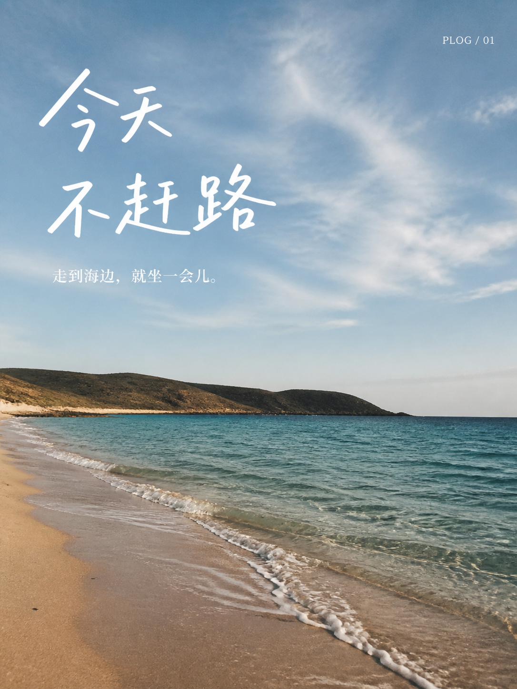

# Plog 风格示意

[返回产品首页](../../README.md) · [查看本轮原图编辑对照](../../README.md#从一张照片到一页-plog) · [素材与过程](MANIFEST.md)

这里保留第一轮直接生成的视觉示意。它们用于看文案和画面的搭配，不作为原图编辑前后对照。

| 山海 | 街景 | 日常 |
| :---: | :---: | :---: |
|  |  |  |
